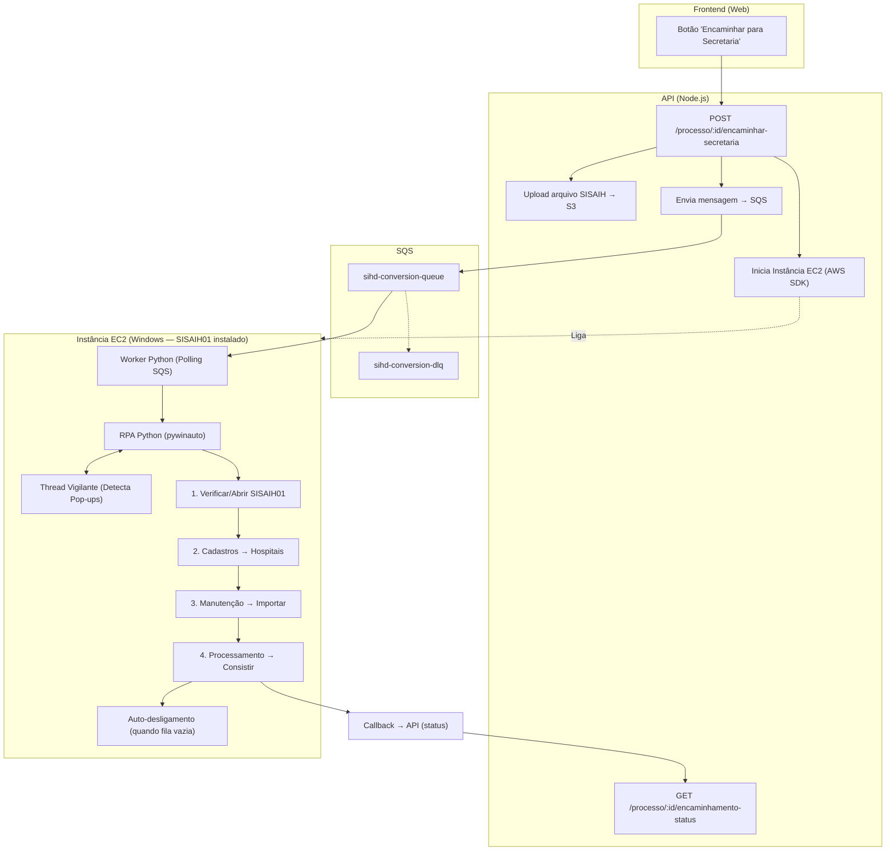
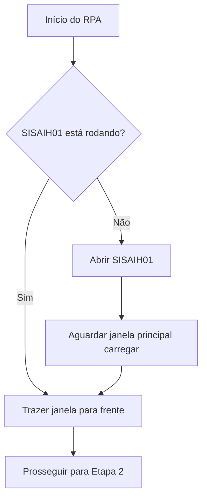
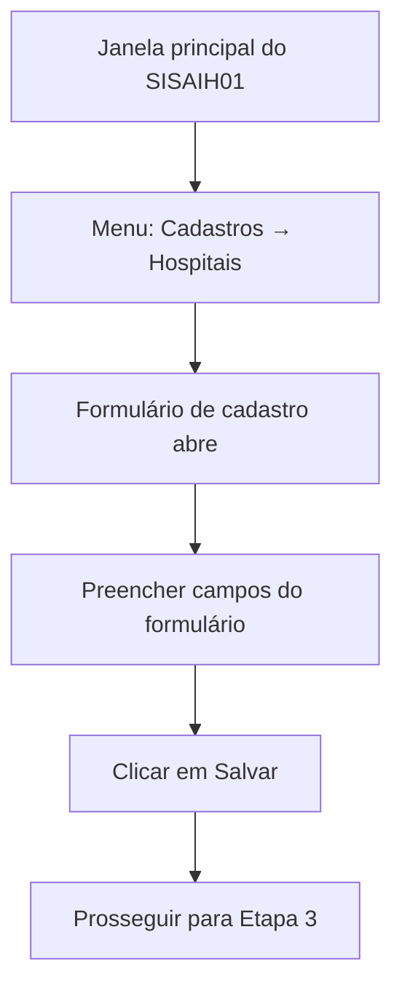
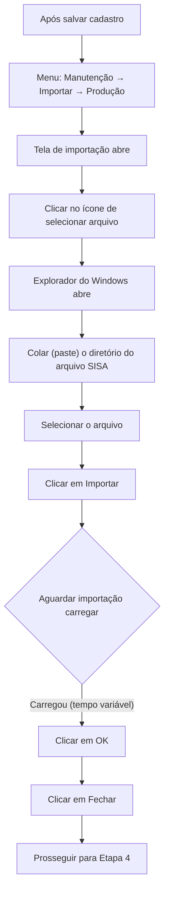
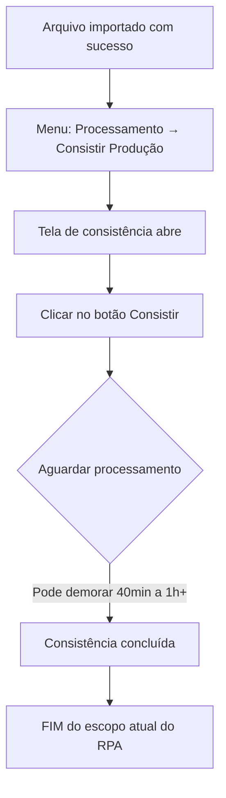
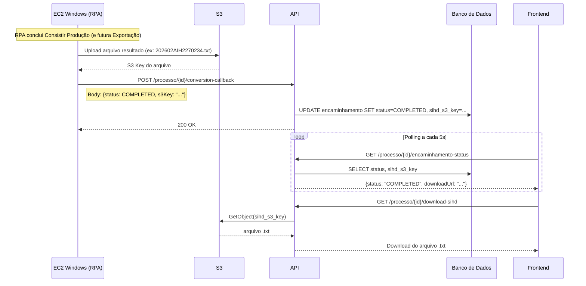

# Arquitetura: Conversão Automática SISAIH01 → SIHD

## Contexto

A plataforma Notória já gera arquivos no layout de exportação do SISAIH. Para encaminhar à Secretaria de Saúde, o arquivo precisa passar pelo programa SISAIH01 (Windows) para ser consolidado e exportado no formato exigido pela secretaria (ex: `202602AIH2270234.txt`).

Hoje o fluxo de "Encaminhar Auditoria" exige **upload manual** de dois arquivos: Espelho PDF + Arquivo Consistido (`.txt` ou `.zip`). O objetivo é **automatizar** este processo.

---

## Arquitetura Proposta



---

## Componentes Detalhados

### 1. Frontend — Botão "Encaminhar para Secretaria"

Adicionar na tela de detalhes da auditoria um botão que:
- Dispara a conversão automática (sem exigir upload manual do arquivo consistido)
- Envia os **dados do hospital** (CNES, nome, etc.) necessários para o cadastro no SISAIH01
- Mostra status em tempo real: `PENDENTE → PROCESSANDO → CONCLUÍDO / ERRO`

### 2. API — Novo Endpoint

```
POST /processo/:id/encaminhar-secretaria
```

**Responsabilidades:**
1. Gerar/obter o arquivo no layout SISAIH para o processo
2. Fazer upload do arquivo para o S3 (`processing-contas-bucket`)
3. Criar registro de encaminhamento no banco (status `PENDING`)
4. Enviar mensagem para a fila SQS `sihd-conversion-queue` incluindo os **dados do hospital** para o cadastro
5. Usar o AWS SDK (`boto3` equivalente no Node.js) para mandar o comando de **Ligar a instância EC2 Windows** (StartInstances). Como o disco da EC2 (EBS) é persistente, o SISAIH01 e os arquivos continuam instalados lá normalmente.

```
GET /processo/:id/encaminhamento-status
```
Retorna o status atual do encaminhamento (polling pelo frontend).

```
POST /processo/:id/rpa-logs
```
Novo endpoint para o script RPA enviar logs de progresso das etapas (ex: `"Iniciando Etapa 2: Cadastro"`, ou detalhes de erros). Esses logs podem ser gravados no banco para o frontend exibir o que o RPA está fazendo em tempo real, sem precisar guardar imagens.

### 3. SQS — Fila de Conversão

| Recurso | Configuração |
|---------|-------------|
| **Queue** | `sihd-conversion-queue`, visibility timeout: 15min, retention: 5 dias |
| **DLQ** | `sihd-conversion-dlq`, maxReceiveCount: 3 |

**Mensagem:**
```json
{
  "processoId": "uuid",
  "competencia": "202603",
  "s3Key": "conversions/{processoId}/input.txt",
  "callbackUrl": "https://api/processo/{id}/conversion-callback",
  "hospitalData": {
    "cnes": "227023-4",
    "nome": "GETULIO VARGAS",
    "codLogradouro": "081",
    "logradouro": "ROMEU CAETANO GUIDA",
    "numero": "22",
    "complemento": "",
    "bairro": "JOCA",
    "telefone": "2649-2006",
    "cep": "21020-124",
    "municipio": "330455",
    "orgaoEmissor": "M330080001",
    "esferaAdministrativa": "PÚBLICO",
    "cpfDiretorClinico": "24561770704",
    "cnsDiretorClinico": "705001439978854",
    "nomeDiretor": "JORGE LUIZ LINCHTENFELS RIBEIRO"
  }
}
```

> [!NOTE]
> O campo `hospitalData` contém os dados do formulário "Cadastro de Hospital" do SISAIH01. Esses dados vêm da API ou do frontend que dispara o trigger na Lambda.

### 4. Worker EC2 (O Orquestrador agora é o Python)

> [!IMPORTANT]
> Removemos a AWS Lambda da arquitetura. O próprio script Python rodando na EC2 Windows vai atuar como Worker consumindo a fila SQS diretamente.

**Stack:** Python + `pywinauto` + `boto3`

**Responsabilidades:**
1. Ao ligar a EC2 (via script de inicialização do Windows/Task Scheduler), o script Python inicia
2. Poll da fila SQS (long-polling) para buscar a mensagem
3. Download do arquivo do S3
4. Executa as interações RPA GUI no SISAIH01
5. Monitora pop-ups inesperados via Thread Vigilante
6. Upload do resultado `.txt` para o S3 e notificação da API (Callback)
7. Quando a fila SQS estiver **vazia**, executa um auto-desligamento (`os.system("shutdown /s /t 10")`) para economizar custos.

### 5. Resiliência do RPA — O "Vigilante" de Pop-ups

O SISAIH01 pode exibir pop-ups de erros de negócio imprevistos ("Aviso", "Atenção", "Erro na importação") que travam a execução do RPA no meio do caminho. 
Para resolver isso, o script usará uma **Thread Paralela (Vigilante)**:
- A cada 5 segundos, ela varre as janelas abertas filhas do SISAIH01.
- Se achar uma janela com título indicando erro/aviso, ela vai **capturar um log** (e opcionalmente a imagem) desse pop-up.
- Ela aborta imediatamente o RPA, fecha tudo, envia o log de erro via `POST /rpa-logs` definindo `status = FAILED`, e pula para a próxima mensagem da SQS.

---

## Fluxo Detalhado do RPA (Escopo Atual)

> [!IMPORTANT]
> Por enquanto o escopo do RPA vai **até o passo de Consistir Produção**. Os passos de exportação e coleta do arquivo final (`[AnoMes]AIH[Cnes].txt`) serão implementados numa fase posterior.

### Etapa 1 — Verificar / Abrir SISAIH01



**Detalhes técnicos:**
- Usar `pywinauto.findwindows.find_elements()` para verificar se existe uma janela do SISAIH01 ativa
- Se não estiver rodando, iniciar o executável a partir do caminho configurado (`config.yaml`)
- Aguardar com timeout (ex: 30s) até a janela principal aparecer
- Enviar log via API `POST /rpa-logs`: `"SISAIH01 aberto e pronto."`

### Etapa 2 — Cadastros → Hospitais (Preencher Formulário)



**Detalhes técnicos:**
- Na janela principal, navegar no menu: **Cadastros → Hospitais**
- O formulário "Cadastro de Hospital" abre com os seguintes campos (mapeados da tela real):

| # | Campo | Tipo | Exemplo |
|---|-------|------|---------|
| 1 | **CNES** | Texto | `227023-4` |
| 2 | **Nome** | Texto | `GETULIO VARGAS` |
| 3 | **Cód do Logr.** | Texto + ícone lookup | `081` → RUA |
| 4 | **Logradouro** | Texto | `ROMEU CAETANO GUIDA` |
| 5 | **Número** | Texto | `22` |
| 6 | **Complemento** | Texto (opcional) | |
| 7 | **Bairro** | Texto | `JOCA` |
| 8 | **Telefone** | Texto | `2649-2006` |
| 9 | **CEP** | Texto | `21020-124` |
| 10 | **Município** | Texto + ícone lookup → UF + Nome | `330455` → RJ - RIO DE JANEIRO |
| 11 | **Órgão Emissor** | Texto | `M330080001` |
| 12 | **Esfera Administrativa** | Dropdown | `PÚBLICO` |
| 13 | **CPF do Diretor Clínico** | Texto | `24561770704` |
| 14 | **CNS do Diretor Clínico** | Texto | `705001439978854` |
| 15 | **Nome do Diretor** | Texto | `JORGE LUIZ LINCHTENFELS RIBEIRO` |

- Após preencher todos os campos, clicar em **Gravar [F5]** (ou pressionar F5)
- Enviar log via API: `"Cadastro do hospital salvo com sucesso."`

> [!NOTE]
> Os dados do formulário vêm do `hospitalData` na mensagem SQS, que por sua vez vêm da API ou do frontend que disparou o trigger.

### Etapa 3 — Manutenção → Importar → Produção



**Detalhes técnicos:**
- Navegar no menu: **Manutenção → Importar → Produção**
- Na tela de importação, clicar no **ícone de selecionar arquivo**
- O Explorador de Arquivos do Windows abre (dialog padrão `Open File`)
- Usar `pywinauto` para colar (paste) o caminho completo do diretório onde está o arquivo SISA
  - Pode usar `SendKeys` para digitar/colar o path na barra de endereço do dialog
- Selecionar o arquivo e confirmar
- Clicar no botão **"Importar"**
- **Aguardar** a importação concluir — o tempo é **variável** e imprevisível
  - Implementar polling: verificar a cada X segundos se o botão "OK" aparece habilitado
  - Definir um timeout máximo (ex: 10 minutos) para evitar travar
- Quando carregar, clicar em **"OK"**
- Clicar em **"Fechar"**
- Enviar log via API: `"Importação concluída com sucesso."`

### Etapa 4 — Processamento → Consistir Produção



**Detalhes técnicos:**
- Navegar no menu: **Processamento → Consistir Produção**
- Clicar no botão **"Consistir"**
- **Aguardar** o processamento — pode levar **40 minutos, 1 hora, ou mais** dependendo do tamanho da conta
  - Implementar polling com intervalo maior (ex: 30s–60s) verificando se aparece algum indicador de conclusão
  - Timeout mais generoso (ex: 2 horas)
  - Enviar logs periódicos via API ("Processando: 10 min...") para indicar que não travou
- Ao concluir, registrar resultado e notificar

> [!WARNING]
> O tempo de "Consistir" é o **gargalo principal** do fluxo. Como pode levar mais de 1 hora, é crucial que a arquitetura não dependa de conexões ativas bloqueadas (por isso usamos Worker autônomo na EC2 em vez de Lambda/HTTP).

---

## Análise Crítica e Melhorias Resolvidas

### ✅ Melhorias Implantadas na Arquitetura

#### 1. Economia Inteligente (Auto-Shutdown)
Como a rotina de fechar competência não é 24/7, a instância EC2 Windows (t3.medium) custaria caro se ficasse ligada direto. Agora, a **API levanta a EC2 via AWS SDK** quando tem trabalho. O Worker Python consome toda a fila SQS. Quando esvaziar, ele **desliga a própria EC2** (`shutdown`). Custo vira centavos.
*(Obs: Desligar a instância EC2 NÃO apaga os dados nem os programas instalados. O disco EBS (C:) é persistente).*

#### 2. Simplificação (Remoção da Lambda)
Foi eliminada a complexidade da Lambda chamar a EC2 via SSM. O Worker está rodando **dentro da própria EC2**, fazendo polling na SQS diretamente via `boto3`.

#### 3. Logging Estruturado (Sem Screenshots excessivas)
O RPA envia requests HTTP para a API contendo logs de cada etapa iniciada/concluída. O frontend consome isso para dar feedback textual ao usuário sem gastar storage do S3 com centenas de prints. Imagens só são salvas em caso de **erro detectado pelo Vigilante**.

#### 3. Semáforo / Lock por CNES
O SISAIH01 trabalha por CNES. Garantir que apenas 1 processo por CNES está sendo processado de cada vez via lock no banco.

#### 4. Retry inteligente
- Retry automático com backoff exponencial
- Após 3 falhas → mover para DLQ → alertar via Slack
- O RPA deve resetar o SISAIH01 (kill + reopen) antes de cada retry

#### 5. Padrão callback assíncrono
- Lambda dispara o RPA e retorna imediatamente
- Script RPA na EC2 executa todo o fluxo
- Ao concluir (ou falhar), a EC2 chama o `callbackUrl` da API para atualizar o status

---

## Escalabilidade

### Cenário Atual (< 50 processos/dia)
- **1 instância EC2 Windows** com SISAIH01 é suficiente
- Processamento serial com fila SQS

### Cenário Futuro (> 50 processos/dia)

- **Pool de instâncias EC2** que o auto-scaling liga sob demanda.
- Vários Workers paralelos escutando a SQS.

### Alternativa: EC2 por demanda (Auto-scaling)
- Subir instância EC2 Windows sob demanda (AMI pré-configurada com SISAIH01)
- Custo: mais alto (boot time ~3-5min), mas escalável
- Usar EC2 Spot Instances para reduzir custo

---

## Estrutura de Projeto Sugerida

```
notoria/processos/
├── modulo-processos/
│   ├── api/            # Endpoints API + Integracao SDK AWS EC2
│   ├── web/            # Frontend
│   └── infra/          # CDK infra (SQS + permissões EC2 Start)
│
└── sihd-converter/                 # Novo projeto RPA (Roda na EC2/VM)
    ├── requirements.txt             # pywinauto, boto3, requests
    ├── config.yaml                  # Queue URL, Paths Locais
    └── src/
        ├── worker.py                # Entry point: loop de Polling da SQS
        ├── sisaih_automation.py     # Orquestrador das 4 fases principais
        ├── vigilante.py             # Thread que monitora pop-ups de erro
        ├── steps/
        │   ├── step1_check_open.py  
        │   ├── step2_cadastro.py    
        │   ├── step3_importar.py    
        │   └── step4_consistir.py   
        └── utils/
            ├── api_client.py        # Manda os logs/callbacks pra API
            ├── s3_handler.py        # Download txt inicial / Upload txt final
            └── ec2_manager.py       # Desligar máquina quando ocioso
```

---

## Padronização de Arquivos (Ciclo de Vida)

### Diretório local na EC2/VM

```
C:\SIHD_CONVERTER\
├── input\        ← Arquivos SISA baixados do S3
├── output\       ← Arquivos convertidos prontos pra upload
└── logs\         ← Logs locais de debug
```

### S3 Key Pattern

| Etapa | S3 Key | Exemplo |
|-------|--------|---------|
| **Input** (API sobe) | `sihd/{processoId}/input/{competencia}_{cnes}.txt` | `sihd/uuid-123/input/202602_2270234.txt` |
| **Output** (Worker sobe) | `sihd/{processoId}/output/{AnoMes}AIH{CNES}.txt` | `sihd/uuid-123/output/202602AIH2270234.txt` |

### Fluxo

1. API sobe o `.txt` SISA pro S3 → envia S3 key na mensagem SQS
2. Worker baixa S3 → `C:\SIHD_CONVERTER\input\{processoId}\arquivo.txt`
3. RPA importa esse path local no SISAIH01
4. Após consistir, RPA localiza o output em `C:\DATASUS\SISAIH01\EXPORT\` (ou path configurável)
5. Worker sobe output pro S3 e notifica API
6. Worker limpa `input\{processoId}\` local

---

## Decisões em Aberto

> [!WARNING]
> Estas decisões precisam ser tomadas antes de iniciar a implementação:

1. **O espelho PDF**: O SISAIH01 gera o espelho durante a consolidação. Devemos capturar ele no RPA ou continuar gerando pela plataforma?
2. **Path de Export do SISAIH01**: Confirmar em qual pasta o SISAIH01 grava o arquivo `.txt` resultado após consistir.

---

### Fluxo de Retorno: EC2 → Frontend

Esta é a sequência completa de como o resultado da conversão volta da EC2 até o frontend:



**Resumo do fluxo:**
1. RPA termina o processamento na EC2
2. EC2 faz **upload do arquivo de resultado** para o S3 (via `boto3`)
3. EC2 chama o **`callbackUrl`** da API com o status e a S3 key do resultado
4. API atualiza o banco: `status = COMPLETED` + salva a `sihd_s3_key`
5. Frontend que está fazendo **polling** no `/encaminhamento-status` recebe `COMPLETED`
6. Frontend exibe botão de **download** → chama `/download-sihd` → API busca do S3 e retorna o arquivo

> [!NOTE]
> Se o RPA falhar, o callback envia `status: FAILED` + mensagem de erro. O frontend mostra o erro e permite retry.

**Colunas do banco** para acompanhamento de estado:

| Coluna | Tipo | Descrição |
|--------|------|-----------|
| `conversionStatus` | ENUM | `PENDING`, `PROCESSING`, `COMPLETED`, `FAILED` |
| `conversionStartedAt` | TIMESTAMP | Quando começou |
| `conversionFinishedAt` | TIMESTAMP | Quando terminou |
| `sihd_s3_key` | TEXT | S3 key do arquivo resultado (`[AnoMes]AIH[Cnes].txt`) |
| `conversionError` | TEXT | Mensagem de erro (se falhou) |
| `conversionAttempts` | INT | Número de tentativas |

---

## Ordem de Implementação Sugerida

1. **Fase 1 — RPA Python**: Criar os steps modulares e o loop de Worker (consumir fila mock). Validar fluxo manualmente na VM local.
2. **Fase 2 — API + Banco**: Criar envio para fila SQS e recepção de logs/webhooks. A API levanta a instância EC2.
3. **Fase 3 — Infraestrutura AWS**: Ajustar permissão IAM pra API rodar o `RunInstances` / `StartInstances`. Configurar Worker inicializando junto com o Boot do Windows.
4. **Fase 4 — Frontend**: Botão UI para disparo e acompanhamento das notificações dos logs pela tela.

---

## Teste Local (Sem AWS)

> [!TIP]
> É possível testar o RPA **100% local**, sem Lambda, SQS, nem EC2. Basta ter uma máquina Windows com SISAIH01 instalado.
> Não importa qual software de VM você usa (VirtualBox, VMware, **Omarchy/QEMU**, Hyper-V, ou mesmo uma máquina física). O RPA só se importa que exista um Windows rodando a janela do SISAIH01.

### Como testar local

1. **Máquina Windows** com SISAIH01 instalado (ex: sua VM Omarchy local)
2. Instalar Python + `pywinauto` na máquina Windows
3. Rodar o script RPA **diretamente** passando os dados como JSON:

```bash
# Na máquina Windows, dentro da pasta rpa/
python sisaih_automation.py --local --data '{
  "cnes": "227023-4",
  "nome": "GETULIO VARGAS",
  ...
}' --arquivo "C:\caminho\para\arquivo_sisa.txt"
```

4. O flag `--local` faz o script pular o callback HTTP e apenas salvar o resultado na pasta local
5. Observar cada etapa visualmente na tela e verificar screenshots gerados

### O que NÃO precisa para testar local
- ❌ Lambda
- ❌ SQS
- ❌ S3
- ❌ EC2
- ❌ SSM

### O que PRECISA para testar local
- ✅ Máquina Windows (física ou VM local)
- ✅ SISAIH01 instalado e configurável
- ✅ Python 3.x + `pywinauto` + `Pillow` (para screenshots)
- ✅ Um arquivo SISA de teste para importar
- ✅ Dados do hospital de teste (JSON)

### Estratégia de desenvolvimento recomendada

1. **Fase 1**: Desenvolver e testar cada step isolado (`step1_check_open.py`, `step2_cadastro.py`, etc.) rodando um por um
2. **Fase 2**: Integrar todos os steps no `sisaih_automation.py` e rodar o fluxo completo local
3. **Fase 3**: Só depois de validado local, subir para EC2 e integrar com Lambda/SQS

---

## Verificação

### Teste E2E (após deploy)
1. Subir a instância EC2 Windows com SISAIH01 instalado e configurado
2. Enviar arquivo via API (isso vai ligar a instância na nuvem)
3. Verificar que o Worker Python na EC2 consome o SQS sozinho
4. Verificar logs (textuais) chegando na API em cada repasse
6. Verificar que o callback final atualiza o banco e exporta o arquivo
7. Verificar que o frontend recebe `COMPLETED` e permite download do `.txt` final
